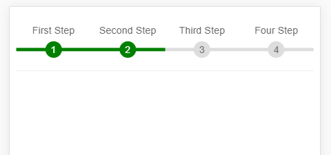

# vue-step

> 基于Vue.js的移动端步骤导航组件 Mobile Step Navigation Component Based On Vue.js

## Build Setup 

``` bash
# install dependencies
npm install
# or
yarn install

# serve with hot reload at localhost:8080
npm run dev
# or
yarn run dev
```

## Usage
``` bash
# example
<template>
  <div id="app">
    <Step :now-step="2" :step-list="stepList"></Step>
  </div>
</template>

<script>
import Step from "./components/Step.vue"

export default {
  name: "app",
  data() {
    return {
      stepList: ['First Step', 'Second Step', 'Third Step', 'Four Step']
    };
  },
  components: {
    Step
  }
};
</script>
```
## API

| Param     | Description       | Type     | Default |
| --------- | ----------------- | -------- | ------- |
| now-step  | The current step  | `Number` | -       |
| step-list | Name of all steps | `Array`  | -       |

## Demo Screenshot



## License
MIT